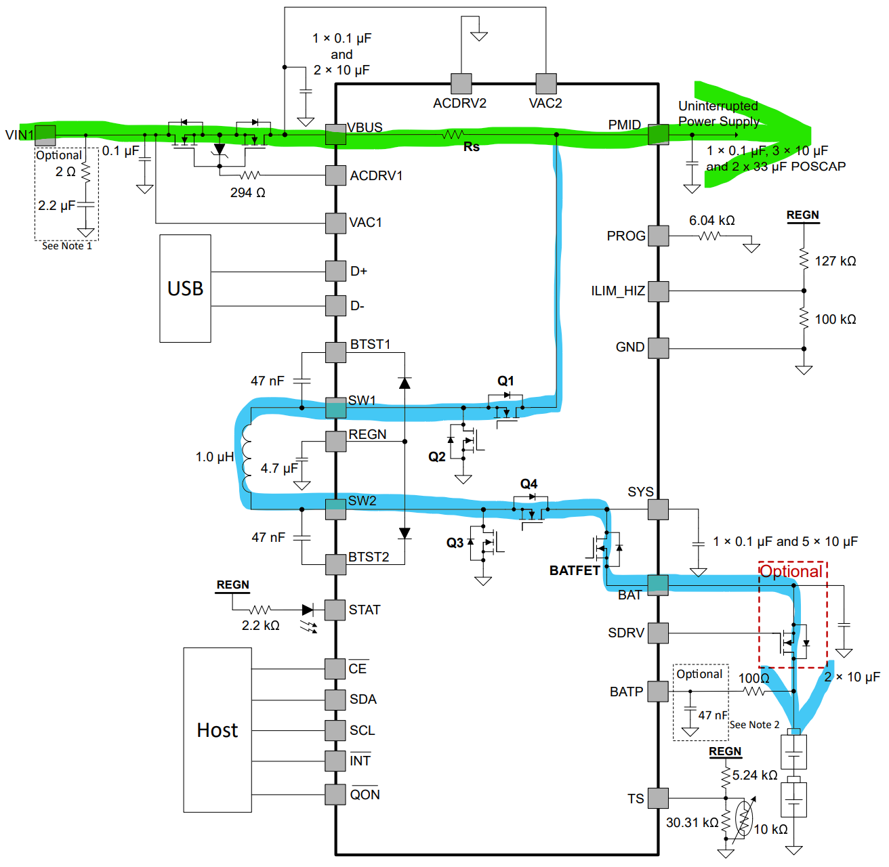
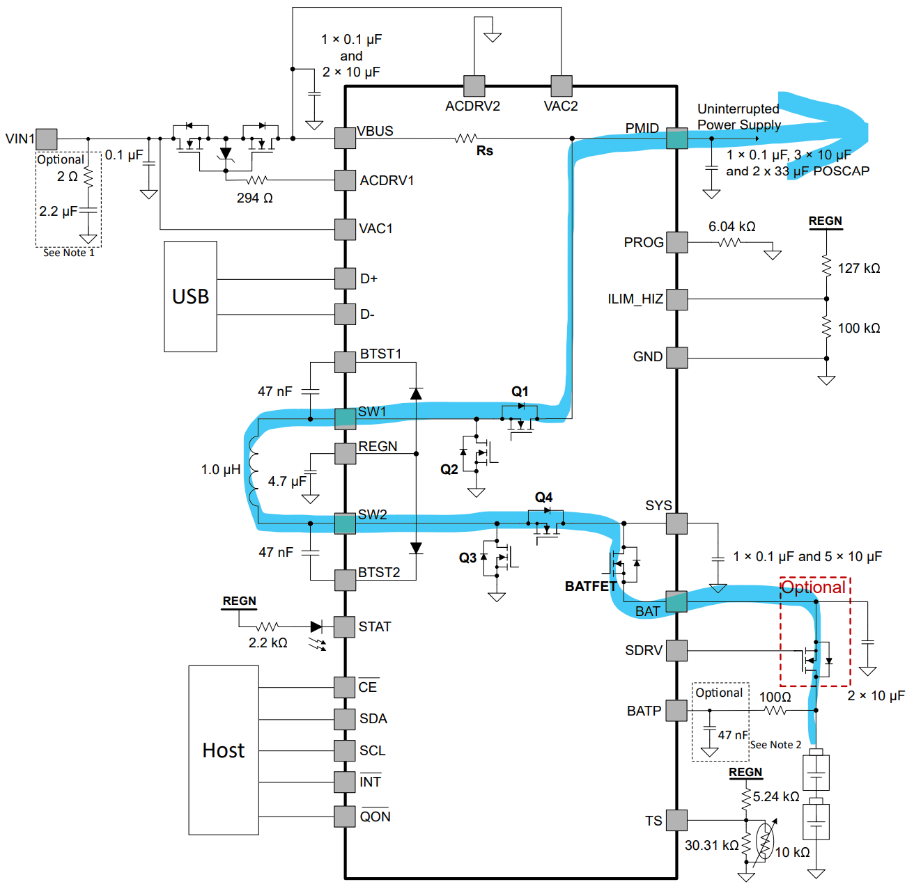

# Goal

A hobby project to create simple 12 V UPS to backup my router and mini PC. Both appliances use 12 volts on input. 
This UPS:
 - should be powered by 18650 batteries
 - does not need to run for a long time, 15 minutes is perfectly OK, 30 minutes is luxury
 - should allow some sort of monitoring, ideally with an HomeAssistant integration (for charts etc.)
 - should provide at least this amount of power
   - 1A (for router)
   - or 3A (for mini PC)
 - should run primarily from the main source and switch to the batteries only when the main voltage drops. This is to protect the batteries and charging circuit so that it doesn't need to constantly provide relatively high power for a device.
 - might allow powering off itself on request when running on batteries, to allow mini PC to automatically power on later after a shutdown.

# Features

 - Can be controlled and monitored using HomeAssistant (ESP32C3 chip, ESPHome software)
 - 12 V / 3 A output
 - (optional) SW controllable output poweroff, can be used to power cycle the device attached to UPS
 - (optional) Battery calibration, i.e. one-off measuring of real available battery capacity.
 - (optional) UPS cut off on power loss and low battery, to allow for a full shutdown of both UPS and the attached device.

# Inspiration
* https://www.hackster.io/news/a-diy-mini-ups-for-wi-fi-router-9b8f11540294
* https://digitalab.org/2021/08/router-ups/
* Lithium battery charger module (12W, 3A) with 5V to 12V booster from Aliexpress:
https://vi.aliexpress.com/item/1005005742927465.html?gatewayAdapt=glo2vnm

# Version 1

Deployed to production, used for a backup of my Archer C6 router only. 
But it's mostly a proof of concept, with power limitations and without a proper PCB (components are just wired up together).

Schema: [schema_v1.pdf](hardware/v1/schema.pdf)

Some photos: [photo1](hardware/v1/IMG_20240301_100945.jpg), [photo2](hardware/v1/IMG_20240302_140645.jpg), [photo3](hardware/v1/IMG_20240302_140731.jpg).

"boosterEnable" input is there not to save power but to prevent running the XL6009 booster in an undervoltage condition. This could have been implemented using a voltage comparator (LM311?) + schmitt trigger for hysteresis. I used software solution because tbne undervoltage condition doesn't occur "suddenly" but it's only a startup condition. And using software to control it allows me to use it for powering off the UPS when it runs on battery.

## Development progress

Replaced AMS1117 with a buck converter due to a large voltage difference and therefore large heat dissipation with LDO.

Added XL6009 "EN" pin control (initial pull down + software control from ESP32).

Used Schottky diodes.

Added a diode between battery power line and XL6009 to prevent backpropagation of voltage when XL6009 is powered down.

The limitations were caused by:
 - BMS module for 18650 batteries can handle only 2A (FIXME?) of current. This is not enough for the mini PC.
 - INA219 module can handle only 3.2A of current. Again, this is not enough for the mini PC (especially not for the battery side of the UPS where the max current can easily be larger).
 - The specific XL6009 booster module doesn't have an undervoltage protection and it can produce more than 12 V on it's output when the input voltage is low. This is not good!

Anyway, this works well for the router. It can run for more than 2 hours from batteries because the router consumes only about 3 watts and the output current is therefore mostly below 300 mA. So I might call this a success ✅!

# Version 2

I wanted to overcome the limitations of the first version and to make it handle larger current to power the mini PC which might need up to 3 A. This higher current would also require something better than the INA219.

I also added relays to allow the UPS to be powered off completely when running on batteries. This is to allow the mini PC to power on automatically after a power outage. And a 2nd relay allows to power cycle the UPS or to run calibration.

ACS712 sensors paired with an ADS1115 ADC are used for current and voltage monitoring. It can handle up to 20 A. 

A pair of XL74610 ideal diodes is used instead of Schottky diodes in v1, to achieve a lower voltage drop and to allow for higher currents.

TP5100 charger module is used for charging the batteries, combined with BMS for 2S 8.4V/20A.

Alas, while everything looked good on the paper, reality was different ❌. The "better" booster module ([LM2587 version](https://www.laskakit.cz/step-up-boost-menic-lm2587--4-30v-30w/)) advertises up to 5A and 30W, but something might be wrong with it. I'm not able to pull more than 1 A from the UPS, the voltage drastically drops if I try to pull more.

Possible causes (investigating ⌛):
 - Batteries don't provide enough current? Not very probable, I'm using 3000 mAh cells from a reputable manufacturer.
 - BMS module can't handle the current? It should be able to handle 20 A but does it?
 - Booster module can't handle the current? It should be able to handle 5 A but does it?
 - Something else?

An idea: disconnect the LM2587 booster and attach an electronic load to the battery instead of it. Then try to pull whatever it takes to see if the batteries can provide the current. If they can, then the problem is with the booster. If they can't, then the problem is with the batteries or BMS.

Result: ⌛

# FIXME TODO 

Maybe this was a completely bad approach. Sticking to 2x 18650 doesn't make sense if I need to pull 3 A. I should have used 4S 18650 (13.6 V - 16.8 V) and eliminate the boost converter completely. When stepping down to 12 V, the current would be lower and the voltage drop would be lower.
Also no need to stick with 12 V and a boost converter on input.

# Version 3

Using **BQ25798** battery charger IC from Texas Instruments. According to the datasheet it can handle up to 5 A on the output and 3A on the input and has a built-in buck-boost converter usable for either battery charging or for the UPS backup mode. It can also be controlled and monitored extensively using I2C.

Product info: https://www.ti.com/product/BQ25798

Most important features:
* Buck-boost charger for 1-4 cell batteries
* Narrow voltage DC (NVDC) power path
* Backup Mode with Ultra-fast switchover to adjustable voltage
* Flexible autonomous and I2C mode for optimal system performance
* Intelligent current management to prevent source overload when charging batteries
* Integrated 16-bit ADC for voltage, current, and temperature monitoring

It's essentially a battery charger capable of using boost converter to charge the batteries, but it can also detect a drop in input voltage and switch to the backup mode aka battery mode very fast. In the backup mode it works as buck converter and uses the batteries to power the load.

So, theoretically, with this IC I can eliminate all the former external circuitry because BQ25798 will take care of both charging the batteries and providing power to the load. And it has hundreds of I2C registers to set up and monitor the system.

#### Normal mode power path:



#### Backup mode power path:



#### Inductor selection

See page 133 of datasheet:

```
L = 2.2 µH (only two inductor values are available: 2.2 µH and 1 µH)

Isat >= MAX((Iin + Iripple/2), Ichg + Iripple/2)

Iripple_buck = Vsys / Vbus * (Vbus - Vsys) / (Fsw * L)
Iripple_boost = Vbus /Vsys * (Vsys - Vbus) / (Fsw * L)
```

For my purposes (12 V input, 12 V output, 4S Li-Ion battery pack, 3 A power source) the values are:

```
Iin = 3 A (input current)
Vbus = 12 V (input voltage)
Vsys = +16.8 V (battery voltage)

Iripple_buck = 12 V / 16.8 V * (16.8 V - 12 V) / (750 kHz * 2.2 uH) = 3.43 / 1.65 = 2.08 A
Iripple_boost = 16.8 V / 12 V * (12 V - 16.8 V) / (750 kHz * 2.2 uH) = -6.72 / 1.65 = -4.07 A

Isat >= MAX(5.08 A, 7.07 A) = 7.07 A
```

#### PROG resistor selection

See page 25 of datasheet:

2.2 uH inductor requires 750 kHz switching frequency. Therefore the PROG resistor = **27 kOhm** which means:
 - Switching frequency = 750 kHz
 - Cell count: 4
 - ICHG: 1 A
 - VSYSMIN: 12 V
 - VREG: 16.8 V (range 14 V - 18.8 V)

### Principle:

#### Forward (battery charge) mode:

In this mode PMID follows VBUS, i.e. it's not regulated. PMID is also the input to the buck-boost converter. 

#### Battery backup mode:

The FETs between AC1 and VBUS provide reverse blocking (prevents battery voltage from being seen at VBUS). PMID is output of the buck/boost converter.
